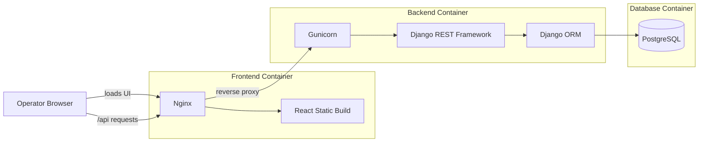
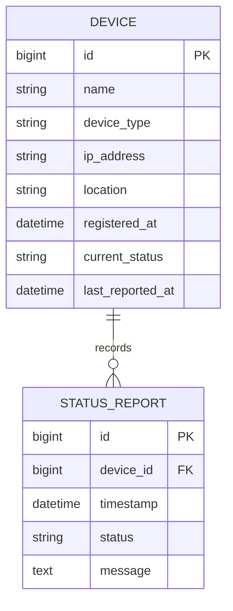
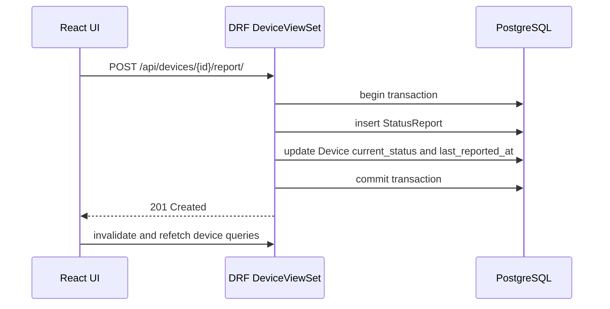
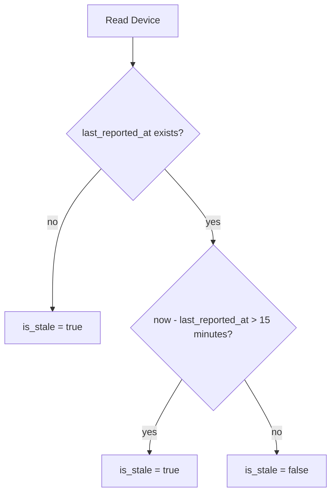

# Architecture Notes

This document explains the design decisions behind the Network Device Monitoring
Service. Operational setup, endpoint lists, and test commands live in
`README.md`; this file focuses on how the pieces fit together and why the system
is shaped this way.

## Runtime Architecture

The frontend and backend are separated at the HTTP boundary. Nginx serves the
compiled React application and proxies `/api/*` requests to the backend service.
The backend owns all domain validation and persistence through Django REST
Framework and the Django ORM.

## Backend Technology Decision

Java and Spring Boot would be a strong fit for a larger production network
management platform, especially where the service needs strict JVM operational
standards, mature enterprise integrations, or a broader microservice ecosystem.
For this scoped monitoring service, Django and Django REST Framework were chosen
because they reduce the amount of framework plumbing needed to express the core
domain clearly.

The main tradeoffs were:

- Django provides migrations, ORM models, validation, serializers, admin tooling,
  and test utilities with little setup, which keeps the implementation focused on
  device and status-report behavior.
- DRF is effective for rapid prototyping because model-backed serializers and
  viewsets make it possible to move from domain model to working REST API quickly
  while still keeping validation and tests explicit.
- DRF maps naturally to the required REST workflow: CRUD for devices plus custom
  actions for status submission and report history.
- Python keeps the code compact enough for the service rules, transaction flow,
  and stale-device behavior to remain easy to inspect.
- PostgreSQL is still used in the containerized runtime, so the database choice
  remains compatible with the recommended persistence layer.

The cost of this choice is that it does not demonstrate Java/Spring Boot
conventions such as controllers, services, repositories, DTOs, and Bean
Validation. That was accepted to prioritize a complete, readable implementation
of the monitoring behavior.

## Domain Model

`Device` is the inventory record and current read model. `StatusReport` is the
historical event log. Keeping both lets the system answer dashboard reads without
losing the report history needed for a device detail view.

## Status Update Flow

The write path is transactional because the latest device state and the historical
report must not drift apart. If report creation succeeds but the device cache is
not updated, the dashboard would show stale current state. If the cache updates
without the report row, the detail history would be incomplete.

## Read Model Choice

The service stores `current_status` and `last_reported_at` on `Device` even
though those values can be derived from the latest `StatusReport`. This is a
small denormalization chosen for the main dashboard path.

The list view needs every device with its latest state. Reading that directly
from `Device` keeps the query simple and avoids repeated "latest report per
device" aggregation. The cost is that status submission has to update two tables,
which is handled inside one database transaction.

## Staleness

Staleness is computed when a device is serialized instead of being stored as a
column. This avoids a scheduler whose only responsibility would be updating rows
as time passes. A newly registered device with no reports is considered stale
because the monitoring system has not yet observed it.

## Frontend Data Strategy

The frontend treats the API as the source of truth. TanStack Query handles fetch
state, mutation invalidation, and periodic polling. The dashboard polls device
state so operators can see status changes and staleness transitions without a
manual refresh.

The UI does not duplicate domain rules such as status choices or staleness
calculation. It displays the values returned by the API, which keeps behavior
consistent between list and detail views.

## Deliberate Scope Limits

- The service exposes an unauthenticated API; authentication and operator roles
  are outside the current scope.
- Status reports are submitted through HTTP. Protocol ingestion such as SNMP,
  syslog, MQTT, or gRPC is not implemented.
- Staleness is evaluated at read time. There is no background worker or message
  queue.
- Device identity is the database primary key. There is no separate external
  asset identifier.
- The IP field accepts IPv4 and IPv6 addresses. Hostname support would require a
  separate field or validator change.
