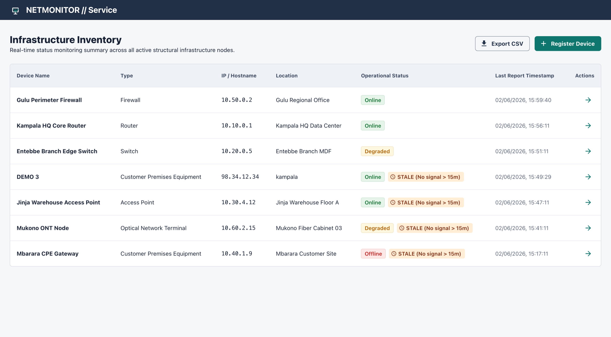

# Network Device Monitoring Service

Monorepo with a Django REST API and a React dashboard for registering network devices and tracking their health.

## Preview

<p align="center">
  
</p>

## What it does

- Create and list devices (type, IP, location)
- Post status reports and keep the latest state cached on the device record
- Expose the last 20 reports per device
- Flag devices as stale if they haven't reported in 15 minutes

## Tech stack

- **Backend:** Python 3.11, Django, Django REST Framework
- **Frontend:** React, Vite, TypeScript, MUI, TanStack Query, React Hook Form + Zod

## API surface

| Method | Endpoint | Notes |
| --- | --- | --- |
| GET | `/api/devices/` | List devices |
| POST | `/api/devices/` | Register device |
| GET | `/api/devices/{id}/` | Device details |
| POST | `/api/devices/{id}/report/` | Submit status report |
| GET | `/api/devices/{id}/history/` | Last 20 reports |

## Project layout

```text
netmonitor-service/
├── backend/            # Django app
├── frontend/           # React app
├── docker-compose.yml  # Local multi-container setup
└── README.md
```

## Run with Docker

```bash
docker-compose up --build
```

- **Frontend:** http://localhost
- **API:** http://localhost:8000/api

Note: The backend uses SQLite while `DEBUG=True`. When `DEBUG=False`, it uses PostgreSQL and reads `DB_NAME`, `DB_USER`, `DB_PASS`, `DB_HOST`, and `DB_PORT`.

## Run locally (no Docker)

Backend:

```bash
cd backend
python -m venv venv
source venv/bin/activate  # On Windows: venv\Scripts\activate
pip install -r requirements.txt
python manage.py migrate
python manage.py runserver
```

Frontend:

```bash
cd frontend
npm install
npm run dev
```

The UI runs at http://localhost:5173 and points to `http://localhost:8000/api` by default. Override with `VITE_API_URL` if needed.

## Tests

```bash
cd backend
python manage.py test
```
